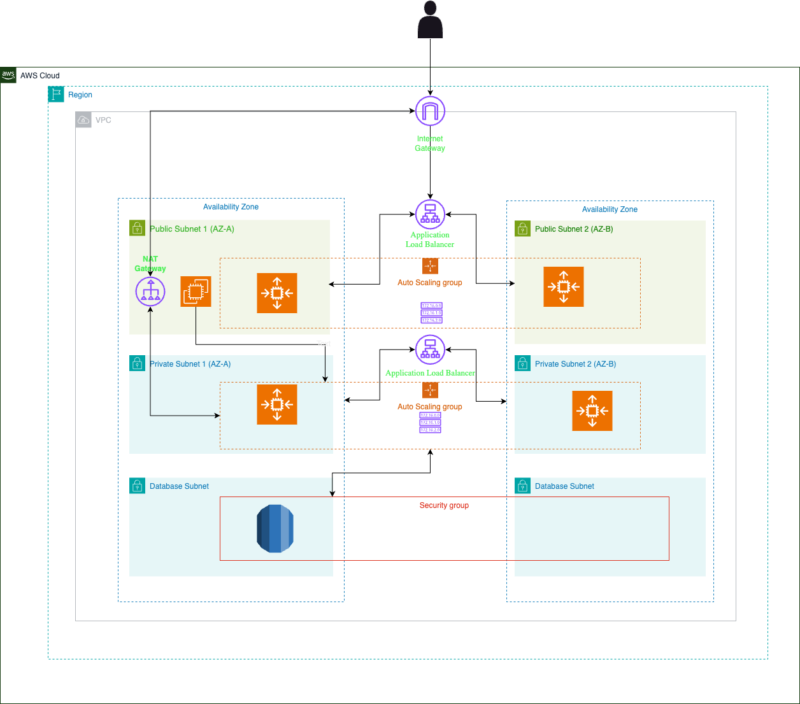

---

# 🚀 Three-Tier Web Application on AWS with Terraform

**Automate your cloud infrastructure like a pro!** Whether you're a beginner exploring Terraform or an experienced engineer seeking scalable cloud solutions, this repository is your guide to deploying a production-grade three-tier architecture on AWS. With Terraform, we’ll transform complex infrastructure setups into code that’s scalable, repeatable, and efficient.

---

## 📜 Project Overview

This repository demonstrates how to build a **Three-Tier Architecture** for web applications, designed to handle high traffic while ensuring scalability, security, and fault tolerance. The architecture separates responsibilities into three distinct layers:

1. **Presentation Layer**  
   - A web server that handles user interactions.  
2. **Application Layer**  
   - Processes requests using EC2 instances managed by Auto Scaling Groups.  
3. **Database Layer**  
   - Manages data storage securely using Amazon RDS (extendable).

---

## 🛠 Features

- **Scalable Architecture:** Automatically adjusts EC2 instances based on demand using Auto Scaling Groups.  
- **High Availability:** Resources are deployed across multiple Availability Zones for resilience.  
- **Load Balancing:** Distributes incoming traffic efficiently via an Application Load Balancer (ALB).  
- **Network Isolation:** Combines public and private subnets for security in a Virtual Private Cloud (VPC).  
- **Infrastructure as Code (IaC):** Fully automated infrastructure provisioning using Terraform.  

---

## 🗂 Project Structure

```plaintext
three-tier-app/
├── main.tf            # Core Terraform configuration
├── variables.tf       # Input variables for modularity
├── outputs.tf         # Outputs like ALB DNS name
├── terraform.tfvars   # Input variable values
└── .gitignore         # Excludes unnecessary files (e.g., Terraform state)
```

**Why This Structure?**  
The modular design separates concerns, ensures scalability, and allows easy extensibility.

---

## 🧑‍💻 Getting Started

### Prerequisites
Before getting started, ensure you have:
1. **Terraform:** Install [Terraform](https://developer.hashicorp.com/terraform/tutorials).
2. **AWS CLI:** Install [AWS CLI](https://docs.aws.amazon.com/cli/latest/userguide/install-cliv2.html).
3. **Git:** Install [Git](https://git-scm.com/downloads).
4. **AWS Credentials:** Configure your AWS account in `~/.aws/credentials`.

---

### Clone the Repository

```bash
git clone git@github.com:satishgonella2024/three-tier-app.git
cd three-tier-app
```

---

## 🚀 Deployment Steps

1. **Initialize Terraform:**
   ```bash
   terraform init
   ```

2. **Preview the Deployment:**
   ```bash
   terraform plan
   ```

3. **Deploy the Infrastructure:**
   ```bash
   terraform apply -auto-approve
   ```

4. **Access the Application:**  
   Retrieve the Application Load Balancer (ALB) DNS name:
   ```bash
   terraform output alb_dns_name
   ```

   Test the application:  
   ```bash
   curl http://<alb_dns_name>
   ```

   Expected Output:  
   ```plaintext
   Hello from <hostname>
   ```

---

## 🌐 Architecture Diagram

Below is the architecture diagram for the three-tier application. It illustrates the flow of traffic and resource placement:



**Traffic Flow:**
1. Incoming traffic is routed via the ALB to EC2 instances.  
2. Application logic is processed within private subnets for enhanced security.  
3. (Extendable) Data is stored in a secure RDS instance located in private subnets.

---

## 📦 Modules and Resources

### Core Modules:
1. **VPC Module:** Creates a VPC with public and private subnets, NAT Gateway, and route tables.  
2. **Application Load Balancer:** Handles traffic distribution to the Auto Scaling Group.  
3. **Auto Scaling Group (ASG):** Dynamically adjusts the number of EC2 instances.  
4. **RDS (Placeholder):** Extendable for adding database functionality.  

---

## 📝 Future Enhancements

- **Secure Traffic:** Add HTTPS support using AWS Certificate Manager (ACM).  
- **Database Integration:** Configure Amazon RDS or Aurora for data persistence.  
- **Advanced Monitoring:** Use CloudWatch metrics, alarms, and dashboards.  
- **Caching:** Integrate AWS ElastiCache for improved performance.  
- **CI/CD Pipeline:** Automate deployments with Terraform Cloud or Jenkins.

---

## 🤝 Contributing

We welcome contributions to improve this project! To get started:  
1. Fork the repository.  
2. Create a feature branch:
   ```bash
   git checkout -b my-feature
   ```
3. Commit your changes:
   ```bash
   git commit -m "Add my feature"
   ```
4. Push the branch:
   ```bash
   git push origin my-feature
   ```
5. Open a Pull Request.

---

## 📂 GitHub Repository

Explore the project and contribute here:  
[Three-Tier Web Application Repository](https://github.com/satishgonella2024/three-tier-app)

---

## 💬 Feedback

Have questions or suggestions?  
Reach out on [LinkedIn](www.linkedin.com/in/satishsubrahmanya) or raise an issue in the repository. Let’s collaborate and build the future of cloud infrastructure together! 🚀

---